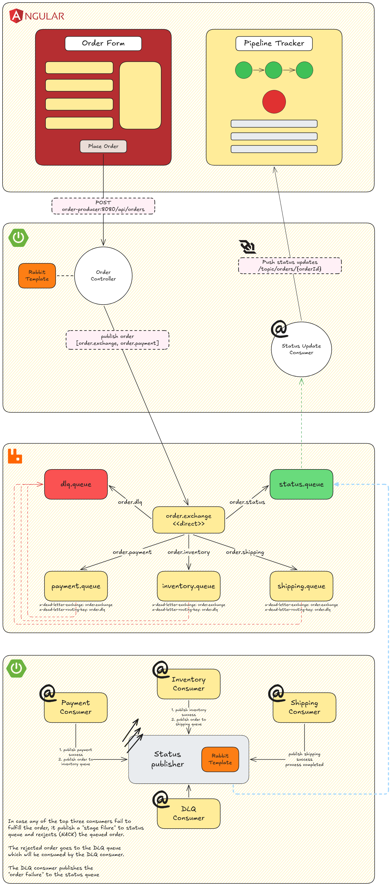

# Rabbitmq Order Pipeline


A demo project that demonstrates an event-driven order processing pipeline using **Spring Boot**, **RabbitMQ**, **Angular**, and **WebSocket/STOMP**.

The project models a real-world order workflow where an order is submitted from a frontend, published to RabbitMQ, processed through a sequential pipeline, and tracked in real time from the browser.

---

## Table of Contents

- [Project Overview](#project-overview)
- [Architecture](#architecture)
- [Tech Stack](#tech-stack)
- [Project Structure](#project-structure)
- [Prerequisites](#prerequisites)
- [Getting Started](#getting-started)
    - [Run Locally](#run-locally)
    - [Run with Docker Compose](#run-with-docker-compose)
- [How It Works](#how-it-works)
    - [Saga Pattern](#saga-pattern)
    - [Sequential Consumer Chain](#sequential-consumer-chain)
    - [DLQ Compensation](#dlq-compensation)
    - [WebSocket Real-Time Updates](#websocket-real-time-updates)
- [RabbitMQ Topology](#rabbitmq-topology)
- [API Reference](#api-reference)
- [Demo Scenarios](#demo-scenarios)
- [Environment Variables](#environment-variables)

---

## Project Overview

`springboot-rabbitmq-order-pipeline` is a multi-module demo application designed to show how asynchronous microservice communication can be implemented with RabbitMQ.

It demonstrates:

- Publishing orders from a REST API into RabbitMQ
- Processing orders through a sequential workflow
- Splitting order processing into payment, inventory, and shipping stages
- Publishing status events after every processing step
- Handling failures with RabbitMQ dead-letter queues
- Pushing live order status updates to an Angular frontend using WebSocket/STOMP
- Running the full stack locally or with Docker Compose

---

## Architecture



The application is composed of four main modules:

| Module | Responsibility |
| --- | --- |
| `order-common` | Shared Java library containing models, enums, and RabbitMQ constants |
| `order-producer` | Spring Boot API service that accepts orders, publishes them to RabbitMQ, consumes status events, and broadcasts WebSocket updates |
| `order-consumer` | Spring Boot worker service that processes orders through payment, inventory, and shipping consumers |
| `order-frontend` | Angular frontend with an order form and real-time pipeline tracker |

### End-to-End Flow

1. The user submits an order from the Angular frontend.
2. The frontend sends a `POST` request to the producer service:
    - `POST /api/orders`
3. The `order-producer` service:
    - assigns an order ID
    - sets the order status to `PENDING`
    - calculates the total amount
    - publishes the order to RabbitMQ using the payment routing key
4. RabbitMQ routes the message to `payment.queue`.
5. The `PaymentConsumer` processes the payment step.
6. If payment succeeds:
    - a status update is published to `status.queue`
    - the order is forwarded to `inventory.queue`
7. The `InventoryConsumer` validates inventory.
8. If inventory succeeds:
    - a status update is published
    - the order is forwarded to `shipping.queue`
9. The `ShippingConsumer` processes shipment.
10. If shipping succeeds:
    - the order is marked as completed
    - a final status update is published
11. The `order-producer` consumes messages from `status.queue`.
12. The producer broadcasts each status event to the frontend through WebSocket/STOMP.
13. The Angular pipeline tracker updates in real time.

If any stage fails, the failed message is routed to the dead-letter queue and handled by the DLQ consumer for compensation/failure status publishing.

---

## Tech Stack

### Backend

| Technology | Version / Details |
| --- | --- |
| Java | 21 |
| Spring Boot | 4.0.6 |
| Spring Web | REST API |
| Spring AMQP | RabbitMQ integration |
| Spring WebSocket | STOMP WebSocket broker |
| RabbitMQ | 4.3.1 Management image |
| Lombok | 1.18.32 |
| Jackson Databind | 2.21.2 in `order-common` |
| Jackson JSR310 | Java time support |
| Maven | Java build tool |

### Frontend

| Technology | Version / Details |
| --- | --- |
| Angular | 21.2.x |
| Angular CLI | 21.2.13 |
| TypeScript | 5.9.2 |
| RxJS | 7.8.x |
| STOMP.js | 7.3.0 |
| SockJS Client | 1.6.1 |
| Tailwind CSS | 4.3.0 |
| PostCSS | 8.5.15 |
| npm | 11.16.0 |

### Infrastructure

| Technology | Usage |
| --- | --- |
| Docker | Containerized services |
| Docker Compose | Full-stack local orchestration |
| RabbitMQ Management UI | Queue and exchange inspection |

---

## Project Structure

```text
springboot-rabbitmq-order-pipeline/
├── docker-compose.yml
├── producer.dockerfile
├── consumer.dockerfile
├── README.md
├── docs/
│   └── architecture.png
│
├── order-common/
│   ├── pom.xml
│   └── src/main/java/com/orderpipeline/common/
│       ├── constant/
│       │   └── RabbitMQConstants.java
│       └── model/
│           ├── Customer.java
│           ├── InventoryResult.java
│           ├── Order.java
│           ├── OrderItem.java
│           ├── OrderStatus.java
│           ├── PaymentResult.java
│           ├── Product.java
│           ├── ShipmentResult.java
│           └── StatusUpdate.java
│
├── order-producer/
│   ├── pom.xml
│   └── src/main/
│       ├── java/com/orderpipeline/producer/
│       │   ├── OrderProducerApplication.java
│       │   ├── config/
│       │   │   ├── RabbitMQConfig.java
│       │   │   └── WebSocketConfig.java
│       │   ├── consumer/
│       │   │   └── StatusConsumer.java
│       │   ├── controller/
│       │   │   └── OrderController.java
│       │   ├── producer/
│       │   │   └── OrderProducer.java
│       │   └── websocket/
│       │       └── StatusWebSocketBroker.java
│       └── resources/
│           └── application.yml
│
├── order-consumer/
│   ├── pom.xml
│   └── src/main/
│       ├── java/com/orderpipeline/consumer/
│       │   ├── OrderConsumerApplication.java
│       │   ├── config/
│       │   │   └── RabbitMQConfig.java
│       │   ├── consumer/
│       │   │   ├── DeadLetterConsumer.java
│       │   │   ├── InventoryConsumer.java
│       │   │   ├── PaymentConsumer.java
│       │   │   └── ShippingConsumer.java
│       │   ├── publisher/
│       │   │   └── StatusPublisher.java
│       │   └── service/
│       │       ├── InventoryService.java
│       │       ├── PaymentService.java
│       │       └── ShippingService.java
│       └── resources/
│           └── application.yml
│
└── order-frontend/
    ├── angular.json
    ├── Dockerfile
    ├── nginx.conf
    ├── package.json
    ├── package-lock.json
    ├── proxy.conf.json
    ├── src/
    │   ├── app/
    │   ├── index.html
    │   ├── main.ts
    │   └── styles.css
    └── public/
        └── favicon.ico
```

---

## Prerequisites

To run the project locally, install:

| Tool | Required Version |
| --- | --- |
| Java JDK | 21 |
| Maven | 3.9+ recommended |
| Node.js | Compatible with Angular 21 |
| npm | 11.x recommended |
| Angular CLI | 21.x |
| Docker | Latest stable |
| Docker Compose | Latest stable |
| RabbitMQ | Required — use Docker (recommended) or install locally |

You can verify your local tools with:

```bash
java -version
mvn -version
node -v
npm -v
ng version
docker --version
docker compose version
```

---

## Getting Started

### Run Locally

#### 1. Start RabbitMQ

Using Docker:

```bash
docker run --name rabbitmq \
  -p 5672:5672 \
  -p 15672:15672 \
  -e RABBITMQ_DEFAULT_USER=guest \
  -e RABBITMQ_DEFAULT_PASS=guest \
  rabbitmq:4.3.1-management
```

RabbitMQ URLs:

| Service | URL |
| --- | --- |
| AMQP | `localhost:5672` |
| Management UI | `http://localhost:15672` |

Default credentials:

```text
Username: guest
Password: guest
```

#### 2. Build the shared module

From the project root:

```bash
cd order-common
mvn clean install
```

#### 3. Run the producer service

```bash
cd ../order-producer
mvn spring-boot:run
```

The producer runs on:

```text
http://localhost:8080
```

#### 4. Run the consumer service

Open another terminal:

```bash
cd order-consumer
mvn spring-boot:run
```

The consumer runs on:

```text
http://localhost:8081
```

#### 5. Run the Angular frontend

Open another terminal:

```bash
cd order-frontend
npm install
ng serve
```

The frontend runs on:

```text
http://localhost:4200
```

If the Angular project uses the provided proxy configuration, you can run:

```bash
ng serve --proxy-config proxy.conf.json
```

---

### Run with Docker Compose

From the project root:

```bash
docker compose up --build
```

This starts:

| Container | Port |
| --- | --- |
| `rabbitmq` | `5672`, `15672` |
| `order-producer` | `8080` |
| `order-consumer` | `8081` |
| `order-frontend` | `80` |

Open the application:

```text
http://localhost
```

RabbitMQ Management UI:

```text
http://localhost:15672
```

Default credentials:

```text
guest / guest
```

To stop all services:

```bash
docker compose down
```

To stop and remove volumes:

```bash
docker compose down -v
```

---

## How It Works

### Saga Pattern

The project uses a simplified sequential saga pattern.

An order goes through multiple business steps:

1. Payment
2. Inventory reservation
3. Shipping
4. Completion

Each step is isolated behind its own RabbitMQ queue and consumer.

Instead of one service doing everything synchronously, the order moves through the system as a message. Each successful stage publishes the order to the next stage.

### Sequential Consumer Chain

The processing chain is:

```text
order-producer
    │
    ▼
payment.queue
    │
    ▼
PaymentConsumer
    │
    ▼
inventory.queue
    │
    ▼
InventoryConsumer
    │
    ▼
shipping.queue
    │
    ▼
ShippingConsumer
    │
    ▼
COMPLETED
```

The order status changes throughout the pipeline:

```text
PENDING
PAYMENT_PROCESSING
PAYMENT_SUCCESS
INVENTORY_PROCESSING
INVENTORY_SUCCESS
SHIPPING_PROCESSING
SHIPPING_SUCCESS
COMPLETED
```

If a step fails, the status can move to:

```text
PAYMENT_FAILED
INVENTORY_FAILED
SHIPPING_FAILED
FAILED
```

### DLQ Compensation

The payment, inventory, and shipping queues are configured with dead-letter settings.

dlq.queue
If a message cannot be processed successfully after retries, RabbitMQ routes it to `dlq.queue`.

The DLQ consumer can then:

- log the failed order
- publish a failure status
- perform compensation logic
- notify the frontend that the order failed

The dead-letter configuration uses:

```text
x-dead-letter-exchange = order.exchange
x-dead-letter-routing-key = order.dlq
```

This allows failed messages from business queues to be routed consistently to the DLQ.

### WebSocket Real-Time Updates

Status updates are published to RabbitMQ using the status routing key.

The flow is:

```text
order-consumer
    │
    ▼
status.queue
    │
    ▼
order-producer StatusConsumer
    │
    ▼
WebSocket/STOMP broker
    │
    ▼
Angular pipeline tracker
```

The frontend subscribes to the WebSocket topic and updates the pipeline tracker as soon as new status messages arrive.

This avoids polling and gives the user immediate feedback as the order moves through.

---

## RabbitMQ Topology

### Exchange

| Name | Type | Purpose |
| --- | --- | --- |
| `order.exchange` | Direct exchange | Routes all order, status, and DLQ messages |

### Queues

| Queue | Purpose |
| --- | --- |
| `payment.queue` | Receives newly submitted orders for payment processing |
| `inventory.queue` | Receives orders after successful payment |
| `shipping.queue` | Receives orders after successful inventory reservation |
| `status.queue` | Receives status events from consumers |
| `dlq.queue` | Receives failed messages from processing queues |

### Routing Keys

| Routing Key | Target Queue | Purpose |
| --- | --- | --- |
| `order.payment` | `payment.queue` | Start the order processing pipeline |
| `order.inventory` | `inventory.queue` | Continue to inventory stage |
| `order.shipping` | `shipping.queue` | Continue to shipping stage |
| `order.status` | `status.queue` | Publish status updates |
| `order.dlq` | `dlq.queue` | Route failed/dead-lettered messages |

### Dead-Letter Configuration

The processing queues are configured with:

| Argument | Value |
| --- | --- |
| `x-dead-letter-exchange` | `order.exchange` |
| `x-dead-letter-routing-key` | `order.dlq` |

Applied to:

- `payment.queue`
- `inventory.queue`
- `shipping.queue`

---

## API Reference

### Create Order

Creates a new order and publishes it to RabbitMQ for asynchronous processing.

```http
POST /api/orders
```

Base URL:

```text
http://localhost:8080
```

Full URL:

```text
http://localhost:8080/api/orders
```

### Request Body

```json
{
  "customer": {
    "name": "Ahmed Ali",
    "email": "ahmed@example.com",
    "shippingAddress": "Cairo, Egypt"
  },
  "items": [
    {
      "product": {
        "id": 1,
        "name": "Laptop",
        "price": 1200.00
      },
      "quantity": 1
    },
    {
      "product": {
        "id": 2,
        "name": "Mouse",
        "price": 25.50
      },
      "quantity": 2
    }
  ]
}
```

### Successful Response

The endpoint returns `202 Accepted` because the order is accepted for asynchronous processing.

```http
HTTP/1.1 202 Accepted
```

Example response:

```json
{
  "id": 123456789,
  "customer": {
    "name": "Ahmed Ali",
    "email": "ahmed@example.com",
    "address": "Cairo, Egypt"
  },
  "items": [
    {
      "product": {
        "id": 1,
        "name": "Laptop",
        "price": 1200.00
      },
      "quantity": 1
    },
    {
      "product": {
        "id": 2,
        "name": "Mouse",
        "price": 25.50
      },
      "quantity": 2
    }
  ],
  "totalAmount": 1251.00,
  "status": "PENDING",
  "createdAt": "2026-06-08T12:30:00"
}
```

### cURL Example

```bash
curl -X POST http://localhost:8080/api/orders \
  -H "Content-Type: application/json" \
  -d '{
    "customer": {
      "name": "Ahmed Ali",
      "email": "ahmed@example.com",
      "address": "Cairo, Egypt"
    },
    "items": [
      {
        "product": {
          "id": 1,
          "name": "Laptop",
          "price": 1200.00
        },
        "quantity": 1
      }
    ]
  }'
```

---

## Demo Scenarios

You can test the application using the Angular frontend or Postman.

### Scenario 1: Successful Order Flow

1. Start RabbitMQ, producer, consumer, and frontend.
2. Open:

```text
http://localhost:4200
```

Or, with Docker Compose:

```text
http://localhost
```

3. Submit a valid order.
4. Watch the pipeline tracker update through:

```text
PENDING
PAYMENT_PROCESSING
PAYMENT_SUCCESS
INVENTORY_PROCESSING
INVENTORY_SUCCESS
SHIPPING_PROCESSING
SHIPPING_SUCCESS
COMPLETED
```

5. Open RabbitMQ Management UI:

```text
http://localhost:15672
```

6. Inspect the queues and verify messages are processed.

### Scenario 2: Submit an Order with Postman

Use:

```http
POST http://localhost:8080/api/orders
Content-Type: application/json
```

Body:

```json
{
  "customer": {
    "name": "Postman User",
    "email": "postman@example.com",
    "address": "Alexandria, Egypt"
  },
  "items": [
    {
      "product": {
        "id": 101,
        "name": "Keyboard",
        "price": 75.00
      },
      "quantity": 2
    }
  ]
}
```

Expected initial response:

```json
{
  "status": "PENDING"
}
```

The exact response also includes generated fields such as order ID, total amount, and creation time.

### Scenario 3: Failure Flow

Depending on the service simulation logic, trigger a failure by sending values that your service layer treats as invalid or failure-inducing.

Common examples in demo services may include:

- invalid product ID
- unavailable product
- zero or negative quantity
- payment-rejected customer
- very large order amount
- shipping-restricted address

Example request for an invalid quantity:

```json
{
  "customer": {
    "name": "Failure User",
    "email": "failure@example.com",
    "address": "Cairo, Egypt"
  },
  "items": [
    {
      "product": {
        "id": 999,
        "name": "Unavailable Product",
        "price": 50.00
      },
      "quantity": 0
    }
  ]
}
```

Possible status flow:

```text
PENDING
PAYMENT_PROCESSING
PAYMENT_SUCCESS
INVENTORY_PROCESSING
INVENTORY_FAILED
FAILED
```

If retries are exhausted, the message is routed to:

```text
dlq.queue
```

The dead-letter consumer then handles the failure and publishes a final failure status update.

### Scenario 4: Observe DLQ Behavior

1. Start the application.
2. Submit a failure-inducing order.
3. Open RabbitMQ Management UI:

```text
http://localhost:15672
```

4. Go to **Queues**.
5. Inspect:

```text
dlq.queue
```

6. Check producer and consumer logs for failure handling.

---

## Environment Variables

The Docker Compose setup uses the following environment variables.

### RabbitMQ Container

| Variable | Default | Description |
| --- | --- | --- |
| `RABBITMQ_DEFAULT_USER` | `guest` | Default RabbitMQ username |
| `RABBITMQ_DEFAULT_PASS` | `guest` | Default RabbitMQ password |

### Producer Service

| Variable | Default in Compose | Description |
| --- | --- | --- |
| `RABBITMQ_HOST` | `rabbitmq` | RabbitMQ hostname |
| `RABBITMQ_PORT` | `5672` | RabbitMQ AMQP port |
| `RABBITMQ_USERNAME` | `guest` | RabbitMQ username |
| `RABBITMQ_PASSWORD` | `guest` | RabbitMQ password |

Producer local defaults from `application.yml`:

| Property | Default |
| --- | --- |
| `spring.rabbitmq.host` | `localhost` |
| `spring.rabbitmq.port` | `5672` |
| `spring.rabbitmq.username` | `guest` |
| `spring.rabbitmq.password` | `guest` |
| `server.port` | `8080` |

### Consumer Service

| Variable | Default in Compose | Description |
| --- | --- | --- |
| `RABBITMQ_HOST` | `rabbitmq` | RabbitMQ hostname |
| `RABBITMQ_PORT` | `5672` | RabbitMQ AMQP port |
| `RABBITMQ_USERNAME` | `guest` | RabbitMQ username |
| `RABBITMQ_PASSWORD` | `guest` | RabbitMQ password |

Consumer local defaults from `application.yml`:

| Property | Default |
| --- | --- |
| `spring.rabbitmq.host` | `localhost` |
| `spring.rabbitmq.port` | `5672` |
| `spring.rabbitmq.username` | `guest` |
| `spring.rabbitmq.password` | `guest` |
| `server.port` | `8081` |

Consumer retry configuration:

| Property | Value |
| --- | --- |
| `spring.rabbitmq.listener.simple.acknowledge-mode` | `manual` |
| `spring.rabbitmq.listener.simple.retry.enabled` | `true` |
| `spring.rabbitmq.listener.simple.retry.initial-interval` | `3000` |
| `spring.rabbitmq.listener.simple.retry.max-retries` | `3` |
| `spring.rabbitmq.listener.simple.retry.multiplier` | `2.0` |

### Frontend Container

The frontend is served with Nginx in Docker Compose.

| Setting | Value |
| --- | --- |
| Container port | `80` |
| Host port | `80` |
| URL | `http://localhost` |

---

## Useful URLs

| Service | URL |
| --- | --- |
| Angular frontend, Docker | `http://localhost` |
| Angular frontend, local dev | `http://localhost:4200` |
| Producer REST API | `http://localhost:8080` |
| Consumer service | `http://localhost:8081` |
| RabbitMQ Management UI | `http://localhost:15672` |

---

## Common Commands

### Build common module

```bash
cd order-common
mvn clean install
```

### Run producer

```bash
cd order-producer
mvn spring-boot:run
```

### Run consumer

```bash
cd order-consumer
mvn spring-boot:run
```

### Run frontend

```bash
cd order-frontend
npm install
ng serve
```

### Run all services with Docker

```bash
docker compose up --build
```

### Stop Docker services

```bash
docker compose down
```

---

## Notes

- The producer returns `202 Accepted` because order processing is asynchronous.
- The frontend receives order status updates through WebSocket/STOMP.
- RabbitMQ is the backbone of the workflow and decouples the services.
- The DLQ provides a safe place for failed messages after retries are exhausted.
- This project is intended as a learning/demo project and can be extended with persistence, authentication, tracing, metrics, and production-grade error handling.
